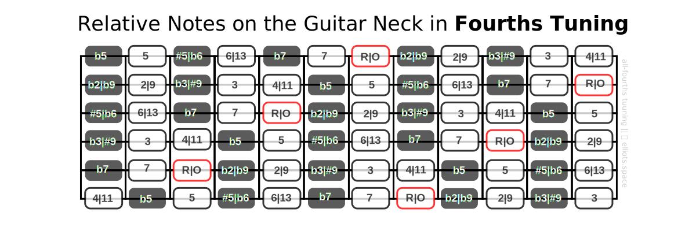
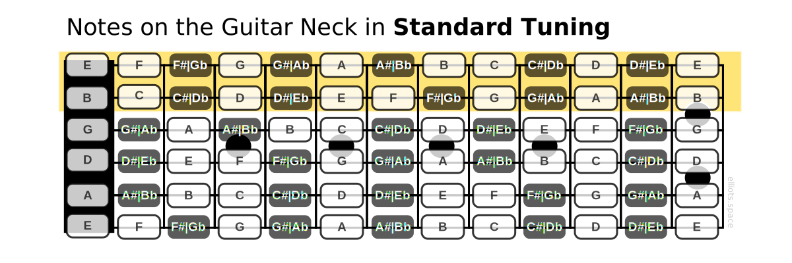

Whether you want to read music or simply learn a few chords for a song, it helps to know where the notes on your guitar are located. In this section I’ll provide the details for your reference.

If you’ve been reading a little on this site already, you’ll know that I use **fourths tuning** instead of the standard EADGBE tuning that most guitarists use. Here is where the notes are located on a guitar tuned in fourths:

For the sake of comparison, here is the same fretboard map in **standard tuning**:

Notice how similar the two tunings are. Although there’s a one-fret shift on the top two strings, the notes on the other strings are identical.

# “Should I memorize where the notes are?”
Some learners make it a goal to learn where every note is on the fretboard. There are certainly advantages to doing that. Knowing where notes are helps you to find them quickly. So learning the names of all the notes on the fretboard is certainly a good goal for any guitarist to have.

However, I’d recommend working toward this goal *gradually* while learning other things. This kind of “dry” information can be tedious to learn. Your time and efforts might be more profitably invested in learning some of the concepts, shapes and patterns that I will present in these lessons.

Incidentally, you can also develop a good working knowledge of where named notes are on the fretboard *indirectly*, from practical activities such as learning songs and chord progressions from sheet music and chord charts.