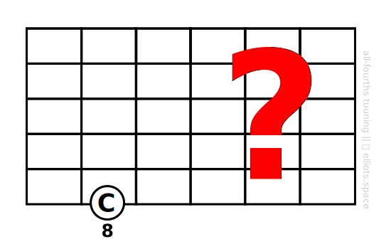
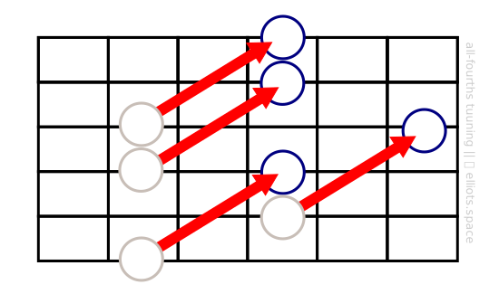

While we’re still on the subject of intervals, I just wanted to write a few words about ***octaves***, especially as they relate to shapes and patterns on the guitar.

An octave is a special kind of interval. You can think of it as the interval between the first and the eighth notes of the major scale. (So I suppose this interval could be called an “eighth”, but ***oct***ave is the usual name – which means something similar in Latin.) Or, in terms of do-re-mi-fa-sol-la-ti-do, it’s the interval between the first ‘do’ and and the last.

Notes which are separated by one or more octaves sound very similar, sort of like the same note but in a different register. For this reason, the two notes will have the same musical name. For example, the note that is one octave above a ‘C’ note will also be called ‘C’.

What does an octave look like on the guitar? Here are two octave shapes that are worth learning:

When it comes to working with patterns and shapes on the fretboard, octaves are very useful. How so? **Octaves give us a handy way to take shapes and patterns we already know and generate equivalent shapes and patterns from them**. This might sound confusing, so let me illustrate by going through some examples.

# Note Names
Suppose we want to find a specific note, say C, somewhere high up on the neck, but the only C that we know is much lower down on the fretboard:

What can we do? Use octaves! Any C note that exists on the fretboard must be separated from our known note by one or more octaves. So starting from the note we know, we can use our octave shapes to ‘jump’ to other C notes. Here you can see how I could discover the locations of three other C notes using this method:

# Intervals
Suppose we have an interval shape like this fifth:

If we want to find alternative shapes with the same interval, all we need to do is replace either or both of the notes with ones that are separated from them by one or more octaves. Here are a few possibilities for substituting the non-root note (can you see any more?):

By the way, if you look back at our intervals map from a previous section, you’ll notice that it is completely consistent with this idea of moving notes up and down in octaves. For example, according to that map the new notes above are also fifths in relation to the root note.

# Scales
We’ll talk about scales in depth a bit later. But for now, let’s note that octaves can help us when working with scale patterns too. Suppose we have a scale pattern that covers one small region of the neck, a minor pentatonic scale, say:

What if we’d like to expand this pattern to cover a larger area of the fretboard? Well, octaves can help here too. Just take each note in our pattern and find the equivalent notes in higher octaves:

In this way we can “print” whole patterns and shapes using octaves across the whole guitar neck.

# Chords
We can apply our trick of moving notes up and down by octaves using chords too. For example, what would be equivalents for this “m7” chord? *(Don’t worry we’ll learn about “m7” and what it means in another lesson.)*

Well, we could move every note in the chord up an octave. In effect the whole shape moves up an octave:

More subtly, we could select an individual note in the chord and replace it with a note that is an octave higher:

In both cases, the chord is the same ‘type’ of chord before and after the transformation – it’s still a ‘m7’ chord. Of course, the switching of octaves that has taken place will change the way it sounds. But hopefully you will have transformed it into something that is more suitable for what you want to play.

# Summary
The purpose of this lesson was to teach you a very useful trick involving octaves. You may find that you will want to use it often. We will certainly be using it more in this course. For now, **try to get familiar with those two octave shapes**. And see if you can **start to use them** to transform or extend shapes and patterns that you already know or simply to locate figure out the names of notes in unfamiliar locations on the guitar neck.