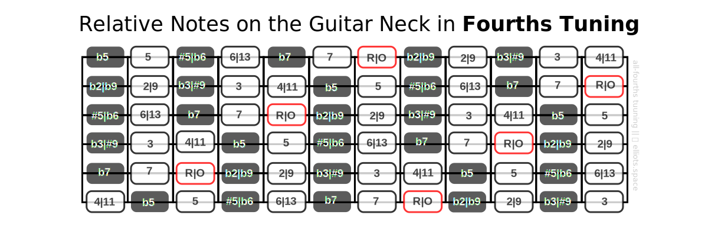
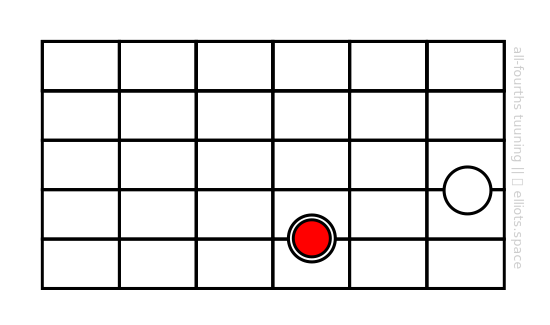
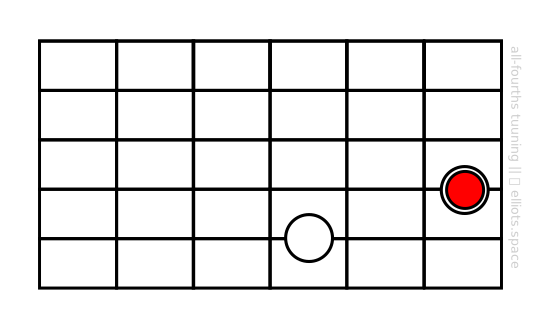
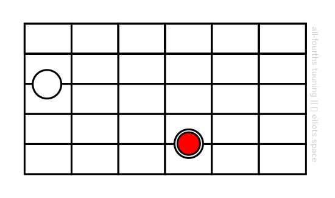
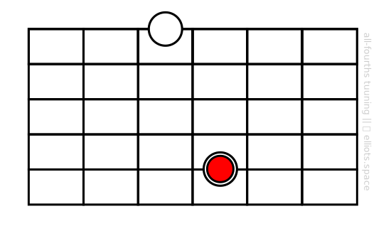

Now let’s talk about intervals which are the building blocks of many important musical entities that we’ll soon need to learn, such as chords, arpeggios and scales.

So what do we mean by an interval? Take a look at the following diagram:

In the picture above we can see two notes. If we were to play those two notes either separately or together as a chord, they would have a characteristic sound. We say that characteristic sound arises because of the distance or interval between the two notes.

Your job as an aspiring advanced guitarist should be to become familiar with (1) how different intervals sound and (2) how they look on the fretboard. Of course, you should also learn the standard way of naming the intervals you see and hear. Let’s learn that next.
# How are intervals named?
There’s a map for that:

This map is different from the map of note names – C, Db, etc. – presented in an earlier section. It shows the names given to the intervals between notes.

Looks complicated? It’s not really. In a moment, we’ll look at some examples to see how this system works.

For now, notice a couple of features of the map:

1. It does not relate to any particular location on the fretboard. It is like an overlay or stencil that can be moved to any position on the neck where it is required.
2. It is an infinitely repeating pattern. In other words you could extend add extra strings an frets in any direction and the pattern would repeat in a predictable way.
# Where do the interval names come from?
Intervals are named by giving each note in the major scale (“do-re-mi”) a number. Here is a summary of how I refer to them in this course:

(This table is here for reference. Feel free to skim through it at this stage.)

| Interval Name on Chart | “do-re-mi” equivalent | How I Refer to It (Depending on Context) |
| ---- | :----: | ---- |
| R \| O | do	| root, unison, octave |
| b2 \| b9 | – | flat second, flat ninth |
| 2 \| 9 | re | second, ninth |
| b3 | –	| minor third |
| 3 | mi | major third |
| 4 \| 11 | fa | fourth, eleventh |
| #11 \| b5 | – | sharp eleven, flat fifth |
| 5 | so | fifth |
| #5 \| b6 | – | sharp/augmented fifth; flat six |
| 6 \| 13 | la | sixth, thirteenth |
| b7 | – | flat seventh |
| 7 | ti | major seventh |

As you can see, some intervals have more than one name. In fact, there are even more names than are shown here. But for simplicity’s sake, I’ve just included the names that you are most likely encounter in your playing.

# How do we identify intervals?
Let’s look at how we’d identify an interval in practice using our map above. For example, what is the interval between the two notes we considered above?

Before we can give a definitive answer to this question, we need to establish which note is acting as the root note (“R”). (Often the context provides clues about which note is the root. More on that in later sections.) For the sake of this example, let’s choose the lower note as the root:

In this case, checking our map at the top of the page we can hopefully see that if the lower note is “R\|O” then the upper note is “5”. So we say that the interval between the two notes is a “fifth”.

By the way, what happens if we make the upper note our root note? 

According to our map, what is the name of the interval now? In this case, the interval is “4”. We call this interval a “fourth”.

This example also teaches something interesting about intervals: **Intervals come in equivalent pairs called inversions that are named based on which note is the root note.** In our examples above, we can say that a fifth is the inversion of a fourth, and vice versa. (What other inversion pairs can you identify in the interval map?)

Now let’s go back to our fifth interval. If you study the map above, you’ll notice that apart from our particular shape, there are a number of note pairs that correspond to an interval of a fifth. In other words, many note pairs are equivalent because they have the same interval. Here are some examples I found:

(By the way, if we were to swap the position of the red note in each case, we would have fourth intervals again. Remember, inversions.)

And here’s another interesting observation. In all-fourths tuning, two notes with the same relative “shape” have the same interval between them, wherever they are on the fretboard. For example, these are both examples of “fifths”:

What this means is very important: With practice, you will be able to recognize intervals by simply looking at their shape. For example, eventually you will only need to glance at the shapes above and think “Those are fifths!”

Of course, the same shape played in a different position on the neck will sound different – either higher or lower pitched. But the internal relationship between notes will be the same and so it will have the same essential character.

# How can I learn intervals?
In the lessons that follow, we will build on new concepts on the idea of intervals. There will be many opportunities to get familiar with the sounds and shapes of the various intervals and how they are used.