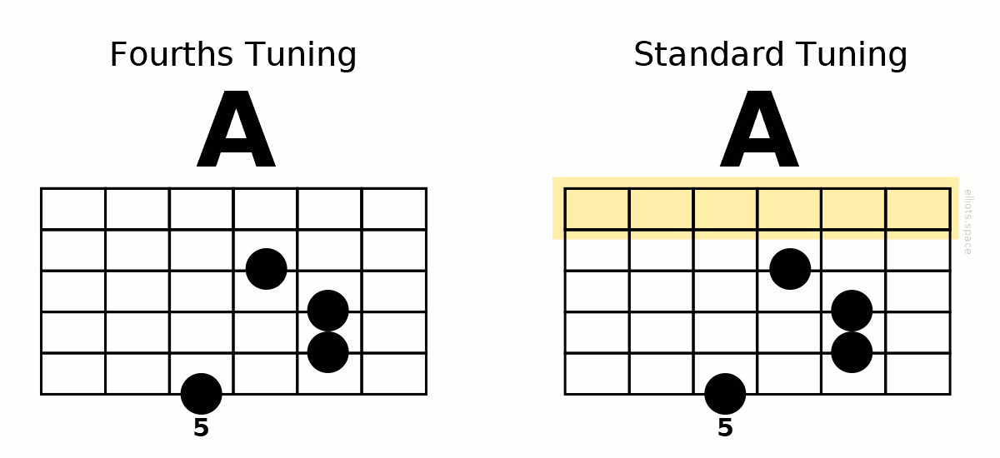

The tuning I use is called ***fourths tuning***. It is the tuning that is used throughout these pages. In this section, I’d like to introduce all-fourths tuning and explain why it I am convinced that it greatly simplifies important aspects of guitar playing.

We’ll begin by talking about the tuning that the vast majority of guitarists still use: standard tuning. Put bluntly, ***standard tuning is irregular***.

In standard tuning, the difference in pitch between every pair of neighboring strings is five frets … well, almost: There’s one exception: The G and B strings are separated by a four-fret interval. How odd!

***So why not just make the difference between all string pairs the same?*** In other words, why not tune the guitar so that starting with the low E string there is a five-fret difference between every pair of adjacent strings?

When you do that, you can say that your guitar is ***tuned in fourths***. (A “fourth” is the musical name used to describe that difference or interval of five frets.) ***The tuning you get is called fourths tuning. It’s also called all-fourths tuning, perfect fourths tuning or P4 tuning.***

Now, instead of that irregular interval between the G and B strings we have ***perfect symmetry*** all across the neck.

Of course having a perfectly symmetric way of tuning the strings is all very well, but how does this change affect the way the guitar is played? I’d sum it up as follows: ***In fourths tuning, shapes and patterns are perfectly consistent all over the guitar neck.***

So what this means is that a chord of a particular type, has the same shape whichever strings it’s played on. Take for example a minor chord:

The same consistency can be seen in patterns for scales, intervals and arpeggios, etc. Look at this major scale pattern, for example:

Notice in the examples above how, compared to fourths tuning, the standard tuning ‘distorts’ chord and scale forms as they move across strings. In effect, that irregular interval between the G and B strings in standard tuning causes the pattern of the top two strings to be pulled up the neck.

This is what all of this means for the guitarist using fourths tuning:

1. Rather than learning separate patterns for each set of strings, they can reuse single shape anywhere on the neck.
2. And with fewer patterns to learn and recognize, they are free to concentrate more of their efforts elsewhere.

In recent years an increasing number of guitarists have been making the switch to fourths tuning. And they appreciate its advantages – so much so that they cannot imagine changing back to standard tuning. ***Why not give fourths tuning a try and experience these advantages for yourself?***