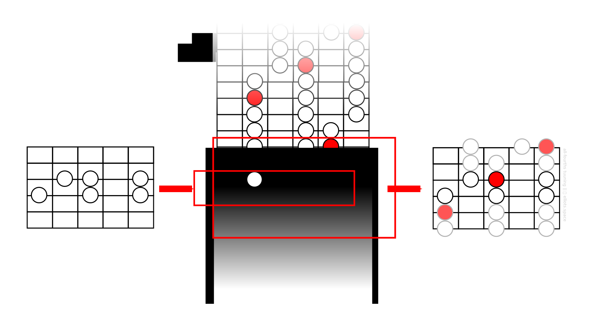
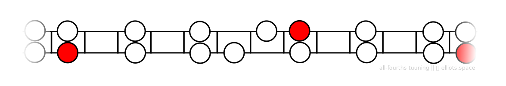
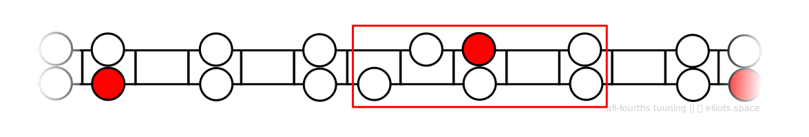
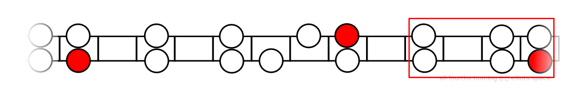

On these pages I’ve been developing the idea that we can learn our way around the guitar fretboard by getting familiar just two fundamental scale patterns, called the horizontal and vertical master patterns.

Before I introduce the horizontal master pattern, let’s remind ourselves of the value of the vertical master pattern. When I am anywhere on the guitar neck and I know a few notes from a scale, the vertical pattern helps me to ‘predict’ where other notes in the scale are located:

Once we know vertical master pattern well, this process of predicting notes happens quickly without conscious thought. And importantly, a guitarist can reach this level of familiarity within a relatively short time because the pattern is simple.

Now let’s think about the horizontal master pattern. Using the vertical pattern as a model, we’d like the horizontal pattern to have the following characteristics: (1) When starting from a familiar scale pattern, it will allow us to predict scale notes on neighboring frets, and (2) it will be simple enough to commit to memory within a short time.

So what does the horizontal master pattern look like? Here it is:

This shape might look very familiar to you. It’s really just a snapshot of the major scale pattern on two strings. As before, the red note corresponds to the root note of our scale.

As we might expect, the pattern repeats itself horizontally. In other words, if you could extend it to the left and the right, you’d notice that the same shapes would come round every 12 frets. So that means that you only really need to get familiar the section of the pattern that is visible above and remember that it ‘loops’ round when you reach its left or right edges.

So how do we use it?

# Using the Horizontal Master Pattern
Think of the situation where you would like to move from one particular fret position to a higher one. You are probably familiar with at least part of the scale pattern of your current position, but what lies to the left and the right is a mystery:

Enter the horizontal master pattern. Can you see our local scale pattern anywhere within the master pattern? Yes, that’s right:

Because we’ve found a match, that means we can glance along the master pattern to predict what the neighboring pattern of notes will be:

This helps me to confidently move up the fretboard to a new position:

Notice that in order for this approach to work I need to know at least a fragment of the scale pattern in my starting position. In most cases as in our example, it is enough to know a cluster of six notes.

---

**Q: Why is this pattern on two strings? Why not a different number of strings?**

While it’s true that other patterns could be used in the same way, *the two-string pattern is a good balance between ease of use and ease of memorization*. However, that’s just my opinion. So don’t let anything stop you from experimenting with different pattern sizes.

---
# What You Need to Do
The process I’ve described above might sound complicated, but once you are familiar with the horizontal master pattern, *you’ll be able to it mentally in a split second*.

So the goal should be clear:

**Memorize the horizontal master pattern!**
---

In the next lesson, I’ll provide some suggestions about how you can accomplish just that.