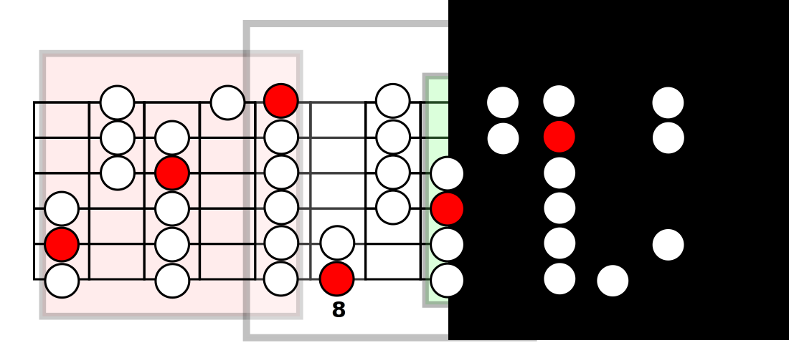
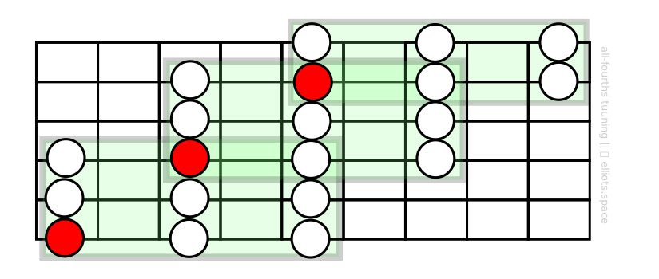
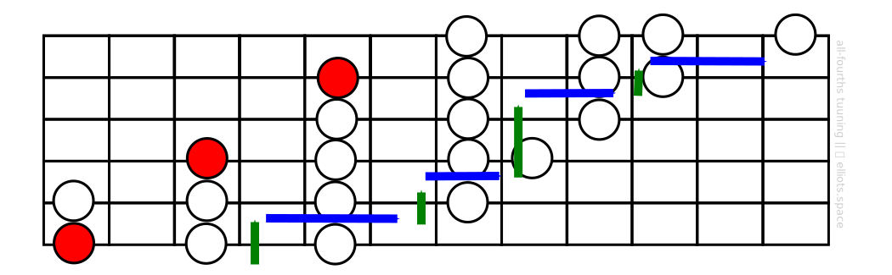

Previously we introduced the idea of scales and showed that on the guitar the notes of scales are usually arranged into multi-string patterns like this one:

Learning a pattern like this one goes a long way. You could use it to locate and play the notes of a tune you want to to learn; You could even use it a guide when improvising a melody or solo of your own.

However, what if we want to move to a different part of the neck, maybe up to the higher frets? How can we “break out” of our pattern and confidently navigate up the fretboard to a different pattern in a higher position?

# Common Approaches
Truly being able to find your way around the fretboard is a challenging problem that requires some study and practice.

Many guitarists solve this problem by memorizing different patterns for different positions. For example, note how if I learn two additional patterns either side of my original shape I can ‘cover’ quite a large area of the guitar neck:

Another common approach is to learn a pattern that covers a bigger range of notes and allows the player to move up the fretboard seamlessly. Here’s an example that repeats the same octave pattern to allow diagonal motion across the guitar neck:

Perhaps you have learned approaches like these and enjoyed the expanded range of motion around the fretboard that they bring compared to being stuck in a small ‘box’ pattern.

On these pages I’d like to present an alternative path to fretboard mastery. It has significant advantages over the common approaches above : By learning a few simple shapes and principles, you’ll have all the mental tools you need to move to any location on the fretboard, even if you’ve never learnt a specific scale pattern for it.

# Introducing Master Patterns
When you move from one place in the guitar neck to another, keeping to a particular scale as you go, you can think of this motion as being *a combination of vertical and horizontal moves*: When you cross from one string to another you move *vertically*; as you shift your hand from one fret position to another you move *horizontally*. Notice how the following scale run can be broken down into a combination of vertical and horizontal components:

Thinking of motion around the fretboard as a mixture of horizontal and vertical components is important because forms the basis for the approach that we will develop here, which can be summed up as follows: **In order to know your way around the fretboard in a given scale you only really need to learn two fundamental patterns that we’ll call the master patterns.**

One of these fundamental shapes – ***the vertical master pattern*** – enables us to move from one string the next with confidence; The other – ***the horizontal master pattern*** – gives us a blueprint for shifting smoothly from one fret position to another.

So think about what that means: Instead of going down the conventional path of learning multiple patterns in multiple positions – or more likely, being limited to too few patterns to fully cover the fretboard – you only need learn two patterns that can be applied universally. If that sounds appealing, then let’s proceed to the next lesson where I will introduce the ***vertical master pattern***.