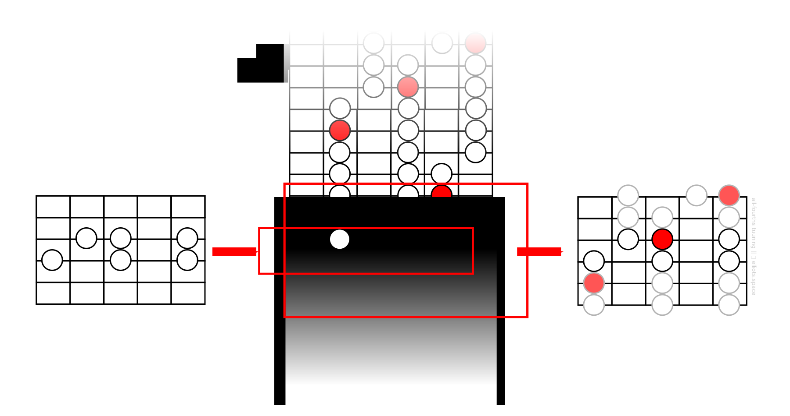

We’ve started developing the idea that in order to know your way around the fretboard you only need to learn ***two master patterns***.

In the last lesson we introduced ***the vertical master pattern***. It looks like this:

Now I’d just like to show you how this pattern can be put to good use, even before you have learnt its companion, the horizontal master pattern. In particular, we’ll look at how it can help us in a few common situations.

# Situation #1: Starting from a Group of Known Notes
One common scenario is where we already know a few of the ‘right’ notes of the scale on our fretboard and we’d like to expand this fragment into a complete pattern. Suppose, for example, you’ve figured out the melody for a song by ear or maybe you’ve been jamming along to a song and you’ve found a few notes that sound like they ‘fit’. And let’s imagine that the known notes look like this:

Can we use the master pattern to expand these few notes into a bigger shape? Yes indeed! Simply search for the distinctive six-note shape above in the master pattern. Can you find it? And can you see what the notes on neighboring strings should look like?

# Situation #2: Starting from the Key Center
Often our starting point in using a scale is its key center. So, for example, we know that we’d like to play a ‘C major scale’. And also let’s suppose that we can locate the C note, or the key center of our scale, somewhere on the neck:

How can we use the master pattern to ‘generate’ a scale map around our known note? Well, look at the master pattern above. Remember what the red notes signify? Yes, precisely the root note or key center of the scale. So if we’d like to build a scale pattern around our C note, the trick is to line it up with one of the red notes in the master pattern. Why not give it a try? You’ll see that in this way we can generate not one but three different patterns around our C note:

# Situation #3: Starting from a Neighboring Pattern
Now consider another situation: You know a scale pattern in one position but you’d like to be able to ‘break out’ of it and move sideways into a different fretboard position:

So how can we use the master pattern to help us in this case? There are two possible approaches.

First of all we could focus on the notes at the edge of our starting pattern and look within the master pattern to find a shape that has a matching set of notes on its opposite edge:

Alternatively, we might be able to guess or deduce at least part of the neighboring pattern. In other words, although I don’t know the neighboring pattern in full, I am at least confident about a few notes within it. For example, I might know these notes:

Those three additional notes form a distinctive little shape that can be found within the master pattern. Once located I can predict the other notes that surround it on the fretboard:

# What You Need To Do
We’ve talked about a few new things in this lesson that might seem complicated. Don’t let this distract you from the main goal: **Memorize the vertical master pattern**. Additionally, why not **start using the master pattern** in the ways outlined above? Use it to help you find scales in various keys; Use it to help you predict notes on neighboring strings when you are “lost”; Use it to map out the scale in unfamiliar regions of the guitar neck. Doing all of this will help you to get familiar and comfortable with this important universal scale pattern.

Of course, to become truly proficient in navigating the fretboard you will still need to learn a second master pattern, **the *horizontal* master pattern**. Let’s talk about this in the next lesson.