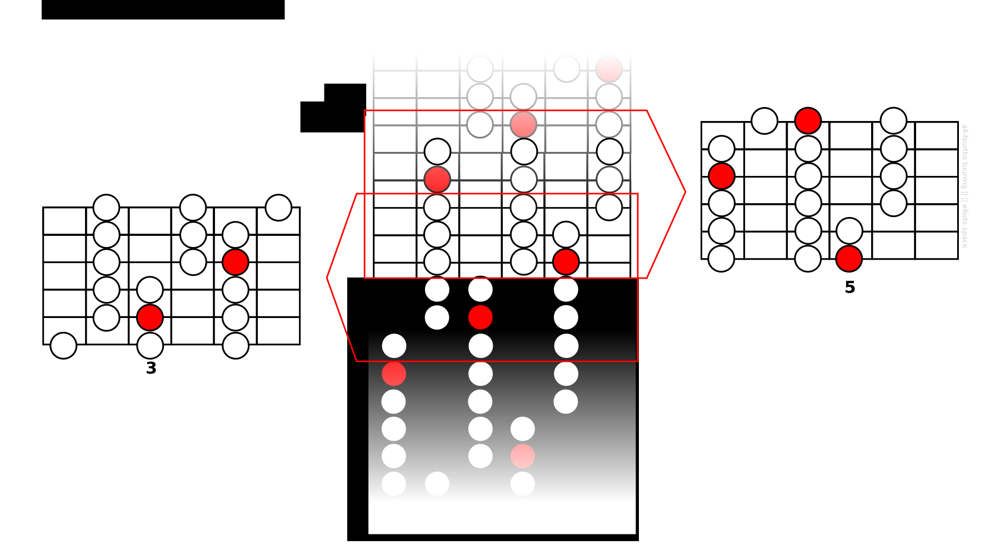

Previously, I mentioned the task of getting familiar the guitar fretboard can be reduced to learning just two universal patterns called the vertical master pattern and the horizontal master pattern.

In this lesson we’ll introduce the vertical master pattern, which gives a blueprint for moving across the fretboard vertically from string to string. That might sound difficult and frightening, but really its similar to something you have met already. Take another look at this scale pattern:

This pattern gives me a map of the notes of a scale at a given fret position. As long as I stay in that position it gives me a formula for moving vertically from string to string.

Well, now I’d like you to imagine something unusual: Suppose we could *add extra strings* to our guitar, both at the higher and lower ends, all tuned in fourths. How would this pattern extend out to the new strings? Something like this:

Do you notice something about the extended pattern? Yes, it repeats: Each string has a three-note pattern on it, and after you played the scale over a certain number of strings, you’ll notice the same sequence of three-note patterns repeats itself all over again in a kind of endless loop. Actually, it turns out that for a seven-note scale like this one, the pattern repeats every seven strings.

This ‘infinite loop’ shape is what we call ***the vertical master pattern***.

**The vertical master pattern is significant because inside it we can find the scale patterns patterns for every possible position on the guitar neck**. Above we saw how the C major scale pattern at the 7th fret lies within the master pattern. Well, have a look at the patterns of same scale in different positions:

Can you see how these additional patterns also lie inside our vertical master pattern?

It’s as if the master pattern is the moon and the various scale patterns are at different positions are its different ‘phases’. We could also say that the master pattern ‘generated’ these other shapes.

So in a sense, **if you know the master pattern, you know all other patterns**. Hopefully you can begin to see why it might be a handy thing to learn as a guitarist. But how do you go about learning it?

# Learning the Vertical Master Pattern
Because the vertical master pattern is infinite, learning it might sound like a challenging task. But remember, it repeats itself every seven strings, so all you’d need to learn is any seven-string sequence from within it. That’s what I did, and this is the seven-string pattern I committed to memory:

Think about what that means: In order to learn the scale patterns in every location on the guitar neck you don’t need to learn separate patterns for each position. One pattern like the one above is sufficient.

# What You Need To Do
Hopefully, this lesson has shown you that the idea of a master pattern might be useful. And maybe you can see that learning this pattern is not such a daunting task. So what should you do now?

**Memorize the vertical master pattern!**
---

In the next lesson, we’ll look at some practical uses for the horizontal master pattern.