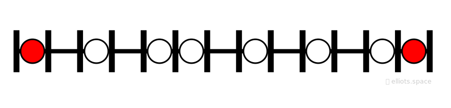
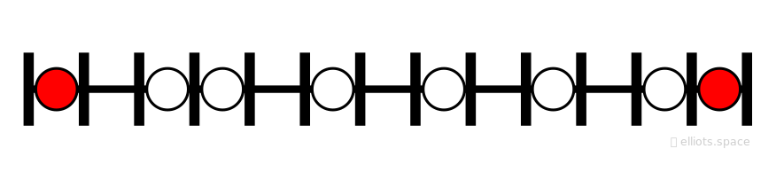
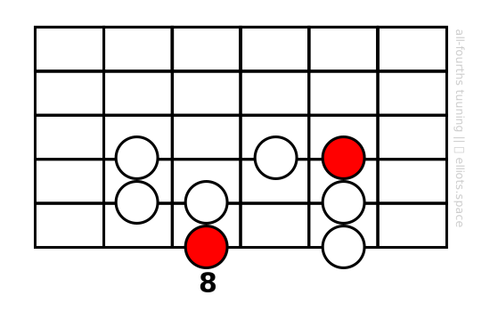
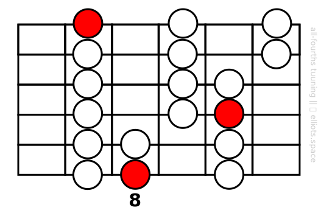

You can think of a scale as a sequence of ascending notes that can serve as the musical ‘palette’ from which you can draw the tones in a melody or chord. In the case of the ***diatonic major (“do-re-mi”) scale***, which we will be using throughout this lesson, this is the sequence as it appears on a single guitar string:

Observe that the notes are not equally spaced. The interval between neighboring notes varies. It’s the unique pattern of intervals that gives each scale its signature “sound”. Just for comparison’s sake, here’s the interval sequence for another scale that we’ll be talking about, ***the melodic minor scale***:

[TODO:Show all the scales that you might come across. Briefly explain why modes of these scales are not shown.]

As an interesting exercise, play each of the scales above on a single string starting from the same note. Can you hear the differences between them?

[TODO: Use of diatonic in lessons. Applies to other scales too. Eventually we’ll provide simple building blocks for each.]

# Scale Patterns
Of course, although playing either of the scales above on a single guitar string would sound fine, it’s not efficient. To save our hand from having to move so far up and down the guitar neck it makes sense to arrange the scale notes in a way that means that our hand can stay in one place. So let’s take do that with our major scale:

Playing these notes from low to high should sound like the familiar major scale. The red note in the diagram is the note “C”. It’s the note that I have chosen to be the key (or key center) of my scale. (I could just as well have chosen B or D, or any other starting note, but of course that would have shifted the pattern to a different position on the guitar neck.)

Knowing a scale pattern like this on the guitar neck is useful. Perhaps I can play some nice sounding phrases with it, or even a popular tune or two. However, it’s a bit restrictive: We only have eight notes to work with. It would be nice if we could have a pattern that covers a wider range of notes. Well, look at this:

This new shape extends our pattern vertically to cover all of the strings. Now we have 18 notes from the C major scale over a range of more than two octaves.

This extended map is of course more useful than the single-octave pattern above. But it’s still limited. Ideally, we want to be able to play our scale anywhere on the neck, but the pattern above still limits us to one position. What’s more, we’d like to be able to move between different parts of the neck without really thinking about it. Reaching that level of skill might sound like something so complicated that would require many years of practice and terrifying feats of memorization. Actually, as we will outline in the following lessons, it needn’t be that difficult.